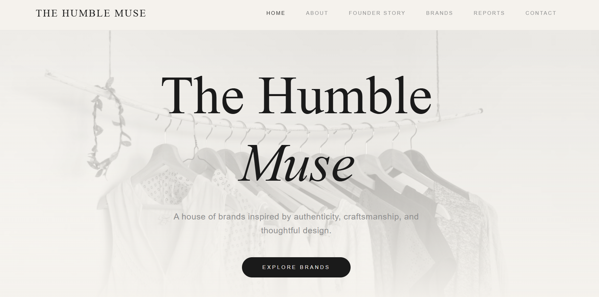

# The Humble Muse



A modern, minimal, and premium house of brands website built for **Hermit Cove LLP**. This project showcases a luxury aesthetic with a focus on authenticity, craftsmanship, and thoughtful design.

## ✨ Features

- **Premium Design**: A clean, luxury-brand feel using a neutral color palette and elegant typography.
- **Responsive Layout**: Fully optimized for mobile, tablet, and desktop devices.
- **Dynamic PDF Viewer**: A custom system to preview and download PDF reports directly from the URL (e.g., `/report1.pdf`).
- **Interactive UI**: Smooth animations and transitions powered by Framer Motion.
- **Brand Showcase**: Dedicated sections for flagship brands like **HUMYN**.
- **Contact System**: Integrated contact form and company location details.

## 🛠️ Tech Stack

- **Framework**: [React](https://reactjs.org/) (via [Vite](https://vitejs.dev/))
- **Language**: [TypeScript](https://www.typescriptlang.org/)
- **Styling**: [Tailwind CSS](https://tailwindcss.com/)
- **Animations**: [Framer Motion](https://www.framer.com/motion/)
- **Icons**: [Lucide React](https://lucide.dev/)
- **Routing**: [React Router](https://reactrouter.com/)

## 📁 Project Structure

- `src/components/`: Reusable UI components (Navbar, Footer, etc.)
- `src/pages/`: Main page components (Home, About, Contact, etc.)
- `src/pages/ReportViewer.tsx`: The dynamic PDF preview engine.
- `public/reports/`: Directory for storing PDF report files.

## 🚀 Getting Started

### Prerequisites

- Node.js (v18 or higher)
- npm or yarn

### Installation

1. Clone the repository:
   ```bash
   git clone https://github.com/your-username/the-humble-muse.git
   ```

2. Install dependencies:
   ```bash
   npm install
   ```

3. Start the development server:
   ```bash
   npm run dev
   ```

### PDF Report System

To add new reports:
1. Place your PDF file in `public/reports/` (e.g., `my-report.pdf`).
2. Access it via `yourdomain.com/my-report.pdf`.
3. The system will automatically generate a preview page with a download option.

## 📄 License

This project is built for **Hermit Cove LLP**. All rights reserved.

---

Built with ❤️ by The Humble Muse Team.
